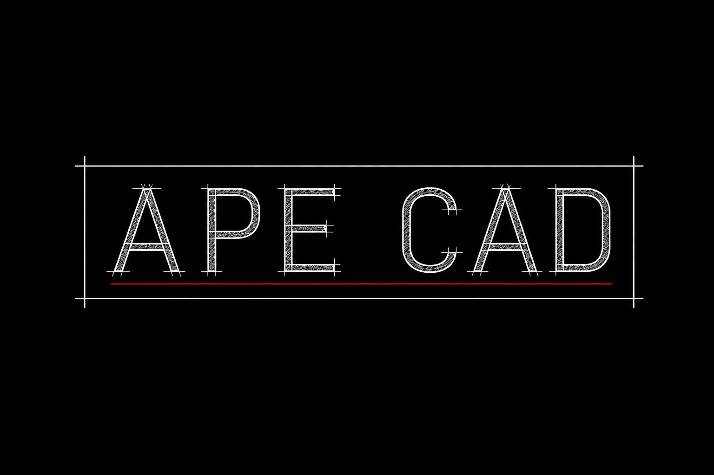

<p align="center">
  
</p>

<p align="center">
  <strong>A three-dimensional napkin.</strong><br>
  Lines, boxes, and labels — so nobody has to describe a building in paragraphs.
</p>

<p align="center">
  <a href="https://nmorabowen.github.io/apeCAD/">Site</a>
  ·
  <a href="AProjects/">AProjects</a>
  ·
  MIT · pre-alpha · Python 3.11+
</p>

<p align="center">
  
  &nbsp;&nbsp;&nbsp;
  
</p>
<p align="center">
  
</p>

---

**apeCAD** is a standalone Python library: a spatial language that humans and agents share. You put down a draft. Downstream libraries consume it.

| This is | This is not |
|---|---|
| A 3D scratchpad — the explanation artifact | SolidWorks, FreeCAD, or a parametric modeller |
| The Python **document** as source of truth | A second Gmsh session |
| A client canvas that emits ops | Studio as CAD — Studio shows and picks |

apeGmsh realizes geometry and mesh. apeSteel takes the frame graph. apeGmsh.studio displays and selects. None of them author the draft.

The drawing window is a **client**. The Python document is the language.

## Quick start

```python
from apeCAD import Document

cad = Document()
a = cad.add_point(0, 0, 0, label="A")
b = cad.add_point(6000, 0, 0, label="B")
cad.add_line(a.entity_id, b.entity_id, label="beam_B1")
cad.add_box((0, 0, 0), (6000, 4000, 200), label="slab_L2")
print(cad.to_json())
```

```text
apeCAD document  →  apeGmsh   realize / mesh
                 →  apeSteel  nodes, members, sections
                 →  Studio    show / pick
```

## Scratchpad

```bash
python -m apeCAD
```

Opens `http://127.0.0.1:8765` (or the next free port). One process, one document — not a machine-wide singleton. Sketch on the XY plane (`z = 0`). The canvas posts ops to Python. Save JSON when you want a file.

```bash
python -m apeCAD --no-browser --port 8765
```

## Install

```bash
git clone https://github.com/nmorabowen/apeCAD.git
cd apeCAD
pip install -e ".[dev]"
pytest
```

Python ≥ 3.11. Pre-alpha (`0.0.0`). The contract lives in [`AProjects/`](AProjects/README.md).

## In this tree

```text
logo/                mark, icons, wordmark
docs/                GitHub Pages — https://nmorabowen.github.io/apeCAD/
src/apeCAD/          public Python package
tests/
AProjects/           ADRs, specs, memory — start here
```

Architecture decisions are append-only: [`AProjects/adrs/`](AProjects/adrs/README.md). Brand assets: [`logo/`](logo/README.md).
